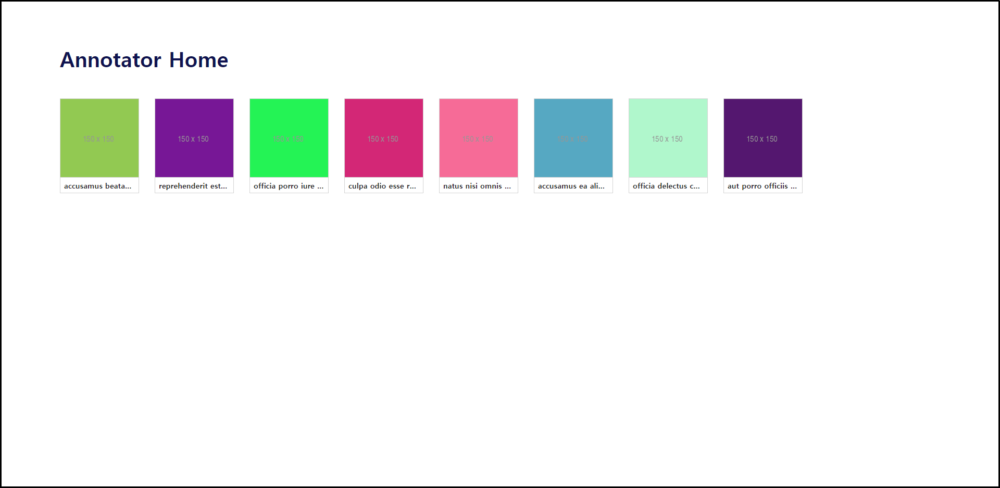

# Labeling Tool

## Description

This project is a labeling tool that operates in a web browser environment. React was used as the UI library.

## Environment

- React v18
- TypeScript v5
- Vite v4
- Vitest v0.30
- React Query v4
- SASS
- PNPM v8
- Node.js v18

## Scripts

### Run in development environment
```bash
$ git clone git@github.com:dlog6649/labeling-tool.git
$ cd labeling-tool
$ pnpm i
$ pnpm dev
```

### Test
```bash
pnpm test
```

### Build
```bash
pnpm build
```

## Sample Image

</img><br/>
</img><br/>

## Play Demo

- https://hbim.netlify.com/
