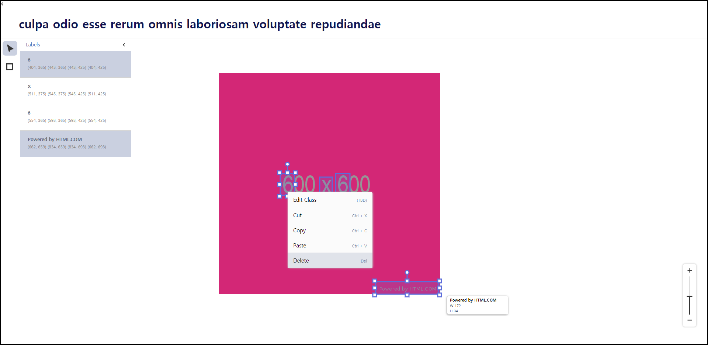

# labeling-tool

## 개요

이 프로젝트는 웹 브라우저 환경에서 동작하는 라벨링 툴입니다.

## 개발환경

- Node.js 10.15.3
- npm 6.14.1
- React 16.13.0
- Redux 4.0.5
- Visual Studio Code 1.43.2
- Chrome 80.0.3987.149

## 개발 환경 실행 

```bash
$ git clone git@github.com:dlog6649/labeling-tool.git
$ cd labeling-tool
$ npm i
$ npm start
```

## 테스트

```bash
npm test
```

## Sample Image

</img><br/>
</img><br/>

## Demo Page

- https://hbim.netlify.com/

* 현재 JSONplaceholder의 응답속도가 매우 느려지는 현상이 발생하고있습니다. 영상 목록이 뜨기까지 한참 기다려야 될 수도 있습니다.